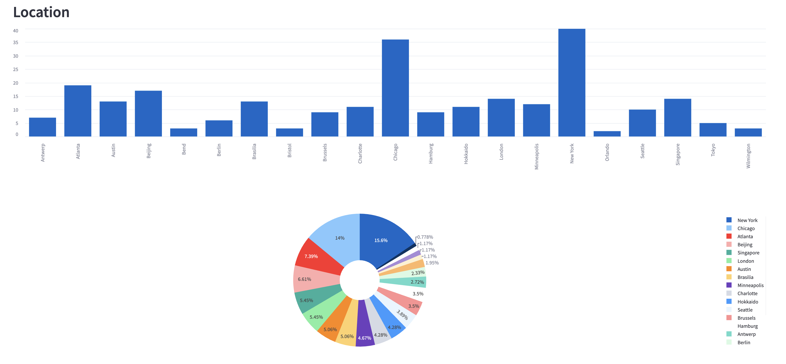

[![Discourse Topics][discourse-shield]][discourse-url]
[![Issues][issues-shield]][issues-url]
[![Latest Releases][release-shield]][release-url]
[![Contributor Shield][contributor-shield]][contributors-url]

[discourse-shield]:https://img.shields.io/discourse/topics?label=Discuss%20This%20Tool&server=https%3A%2F%2Fdeveloper.sailpoint.com%2Fdiscuss
[discourse-url]:https://developer.sailpoint.com/discuss/tag/workflows
[issues-shield]:https://img.shields.io/github/issues/sailpoint-oss/repo-template?label=Issues
[issues-url]:https://github.com/sailpoint-oss/repo-template/issues
[release-shield]: https://img.shields.io/github/v/release/sailpoint-oss/repo-template?label=Current%20Release
[release-url]:https://github.com/sailpoint-oss/repo-template/releases
[contributor-shield]:https://img.shields.io/github/contributors/sailpoint-oss/repo-template?label=Contributors
[contributors-url]:https://github.com/sailpoint-oss/repo-template/graphs/contributors

# colab-identity-mesh-visualizer

[New to the CoLab? Click here »](https://developer.sailpoint.com/discuss/t/about-the-sailpoint-developer-community-colab/11230)

This project provides interactive data visualizations and network analysis for identity data, presented at SailPoint Developer Days 2025. It leverages Python, Streamlit, Plotly, PyDeck, and PyVis to present insights into organizational identities, departments, locations, and reporting structures.

## Author

Scott Fehrman  
[scott.fehrman@sailpoint.com](mailto:scott.fehrman@sailpoint.com)

## Features

- **Pie Charts, Heatmaps, Scatter, and 3D Scatter Plots**: Visualize identity distributions by department, location, and other attributes.
- **Interactive Maps**: Display identity locations using PyDeck.
- **Organizational Graphs**: Explore reporting relationships with interactive network graphs (PyVis/vis-network).
- **Custom JavaScript Bindings**: Enhance network graph interactivity.

## Project Structure

```text
.
├── app.py                # Main Streamlit app
├── requirements.txt      # Python dependencies
├── assets/images/        # Screenshots
├── lib/                  # Frontend libraries (JS/CSS)
│   ├── bindings/
│   │   └── utils.js      # Custom JS for network graph interactivity
│   ├── tom-select/       # Tom Select library
│   └── vis-9.1.2/        # vis-network library
├── utilities/            # Python utility modules
│   ├── charts.py         # Plotly chart functions
│   ├── graphs.py         # Graph/network utilities
│   ├── maps.py           # Map visualizations
│   └── sptk.py           # SailPoint Toolkit integration
├── identities_reportsto.html # Generated network graph HTML
├── coordinates.csv       # Cached Location coordinate data (lan, lon)
├── config.json           # Configuration (excluded from git)
```

## Setup

1. **Activate virtual environment**

    ```zsh
    source .venv/bin/activate
    ```

2. **Install Python dependencies:**

   ```zsh
   pip install -r requirements.txt
   ```

3. **Create `config.json` file**

    ```json
    {
        "ClientId": "TENANT_CLIENT_ID",
        "ClientSecret": "TENANT_CLIENT_SECRET",
        "BaseURL": "https://TENANT_URL"
    }
    ```

4. **Run the Streamlit app:**

   ```zsh
   streamlit run app.py
   ```

## Usage

- The app loads identity data, normalizes it, and provides multiple visualization options.
- The "Graph: Reports To" section generates an interactive org chart using vis-network and custom JS (`lib/bindings/utils.js`).
- Map and chart visualizations are powered by `utilities/charts.py` and `utilities/maps.py`.


## Demo

### DataFrames

Display the Panda's DataFrames.  Includes both default and normalized examples.


### Locations

Display charts showing **Location** information.



### Departments

Display charts showing **Department** information.


### Heatmap

Display heatmap showing relationship of **Location** and **Department**.


### Scatter

Display scatter chart for relationship of **Location** and **Department**.


### 3D Scatter

Display 3D scatter chart for relationship of **Location** and **Department** and **Quantity**.


### Map

Display a map with columns for each location, the height is relative to the quantity.


### Graph

Display a Network Graph that shows the manager relationship between the identities.


## Customization

- Update `config.json` for environment-specific settings.
- Modify or extend chart types in `utilities/charts.py`.
- Add new JS interactivity in `lib/bindings/utils.js`.

<!-- CONTRIBUTING -->
## Contributing

Contributions are what make the open source community such an amazing place to learn, inspire, and create. Any contributions you make are **greatly appreciated**.

If you have a suggestion that would make this better, please fork the repo and create a pull request. You can also simply open an issue with the tag `enhancement`.
Don't forget to give the project a star! Thanks again!

1. Fork the Project
2. Create your Feature Branch (`git checkout -b feature/AmazingFeature`)
3. Commit your Changes (`git commit -m 'Add some AmazingFeature'`)
4. Push to the Branch (`git push origin feature/AmazingFeature`)
5. Open a Pull Request

<!-- LICENSE -->
## License

Distributed under the MIT License. See `LICENSE.txt` for more information.

<!-- CONTACT -->
## Discuss
[Click Here](https://developer.sailpoint.com/dicuss/tag/{tagName}) to discuss this tool with other users.
